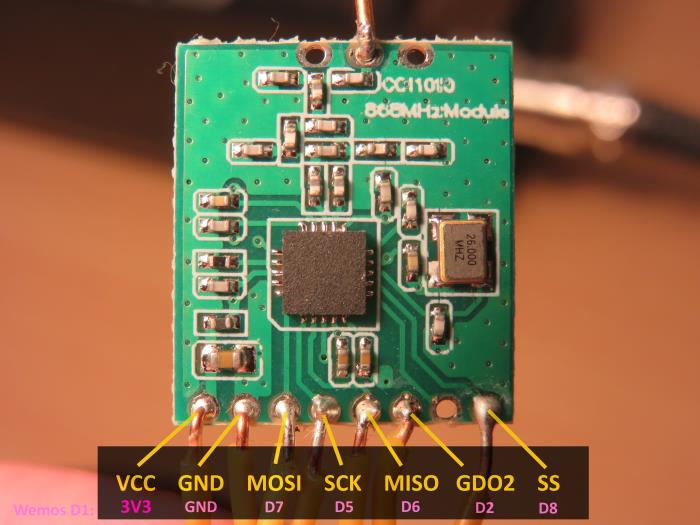
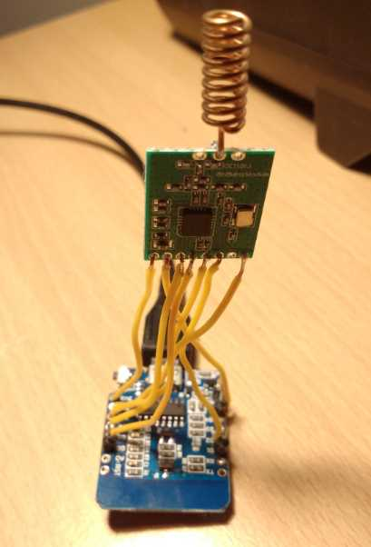

# Easy-IoT-Arduino-CC1101-LORA

This is an easy to use Arduino CC1101 library (working example) to be able to connect a [Texas Instruments CC1101](http://www.ti.com/product/CC1101) to a ESP32, ESP8266 or AVR device (i.e. Arduino Nano).

## Buying a CC1101

CC1101 modules can be bought [for a few bucks](https://www.aliexpress.com/item/CC1101-Wireless-Module-Long-Distance-Transmission-Antenna-868MHZ-M115/32635393463.html). These modules are tolerant of voltages ranging from 1.8 to 3.3 volts. If using a 5volt Arduino AVR device, you will need to use a 5V to 3.3V logic-level converter across the pins or you will FRY your CC1101.

## Using a CC1101

Whilst the CC1101 is almost a 10 year old device, it is used is MANY low power or long life battery operated devices to transmit data. Given these transceivers work on the low frequency ISM bands (433, 868, 915 etc.), signals can travel a fair distance. The CC1101 is technically [better](https://www.youtube.com/watch?v=7zLUYswu3Ek) to the often mentioned LoRA / Semtech chip technology [apparently](https://e2e.ti.com/support/wireless-connectivity/sub-1-ghz/f/156/t/343273?Semtech-LoRa-vs-Performance-line-TI#).

Whilst the CC1101 has some [show stopper bugs](http://www.ti.com/lit/er/swrz020e/swrz020e.pdf) this Arduino library aggressively works around these issues and as a result is reliable with continuous send and receive operation. 

This library supports sending large strings/streams of data, using multiple 61 byte radio packets (that's the CC1101's underlying fixed radio packet size). However, using this functionality increases the risk of lost data - so your own packet/message acknowledgement code would be required. 

## Installation

Pull this repository, and load the .ino file onto two ESP8266 devices with the opposite sending/receiving addresses configured (refer to the sketch code).

## Connecting your ESP 8266 (example)

Use the standard SPI ports to connect to the 8 pins on the CC1101 module. For example, with the Wemos D1 Mini (ESP8266 Chip), it's easy as:





Example serial output with debugging:
```
Starting...
Writing to CC1101 reg IOCFG2 [0] value (HEX):	6
Writing to CC1101 reg IOCFG1 [1] value (HEX):	2E
Writing to CC1101 reg IOCFG0 [2] value (HEX):	6
Writing to CC1101 reg FIFOTHR [3] value (HEX):	7
Writing to CC1101 reg PKTLEN [6] value (HEX):	3D
Writing to CC1101 reg PKTCTRL1 [7] value (HEX):	6
Writing to CC1101 reg PKTCTRL0 [8] value (HEX):	44
Writing to CC1101 reg SYNC1 [4] value (HEX):	D3
Writing to CC1101 reg SYNC0 [5] value (HEX):	91
Writing to CC1101 reg ADDR [9] value (HEX):	20
Writing to CC1101 reg CHANNR [A] value (HEX):	10
Writing to CC1101 reg FSCTRL0 [C] value (HEX):	0
Writing to CC1101 reg FREQ2 [D] value (HEX):	21
Writing to CC1101 reg FREQ1 [E] value (HEX):	65
Writing to CC1101 reg FREQ0 [F] value (HEX):	6A
Writing to CC1101 reg MCSM2 [16] value (HEX):	7
Writing to CC1101 reg MCSM1 [17] value (HEX):	30
Writing to CC1101 reg MCSM0 [18] value (HEX):	18
Writing to CC1101 reg MDMCFG2 [12] value (HEX):	13
Writing to CC1101 reg MDMCFG1 [13] value (HEX):	22
Writing to CC1101 reg MDMCFG0 [14] value (HEX):	F8
Writing to CC1101 reg BSCFG [1A] value (HEX):	6C
Writing to CC1101 reg AGCCTRL2 [1B] value (HEX):	43
Writing to CC1101 reg AGCCTRL1 [1C] value (HEX):	40
Writing to CC1101 reg AGCCTRL0 [1D] value (HEX):	91
Writing to CC1101 reg FREND1 [21] value (HEX):	B6
Writing to CC1101 reg FREND0 [22] value (HEX):	10
Writing to CC1101 reg FSCTRL1 [B] value (HEX):	C
Writing to CC1101 reg MDMCFG4 [10] value (HEX):	2D
Writing to CC1101 reg MDMCFG3 [11] value (HEX):	3B
Writing to CC1101 reg DEVIATN [15] value (HEX):	62
Writing to CC1101 reg FOCCFG [19] value (HEX):	1D
Writing to CC1101 reg BSCFG [1A] value (HEX):	1C
Writing to CC1101 reg AGCCTRL2 [1B] value (HEX):	C7
Writing to CC1101 reg AGCCTRL1 [1C] value (HEX):	0
Writing to CC1101 reg AGCCTRL0 [1D] value (HEX):	B0
Writing to CC1101 reg FREND1 [21] value (HEX):	B6
Writing to CC1101 reg WOREVT1 [1E] value (HEX):	87
Writing to CC1101 reg WOREVT0 [1F] value (HEX):	6B
Writing to CC1101 reg WORCTRL [20] value (HEX):	FB
Writing to CC1101 reg FSCAL3 [23] value (HEX):	EA
Writing to CC1101 reg FSCAL2 [24] value (HEX):	2A
Writing to CC1101 reg FSCAL1 [25] value (HEX):	0
Writing to CC1101 reg FSCAL0 [26] value (HEX):	1F
Writing to CC1101 reg RCCTRL1 [27] value (HEX):	41
Writing to CC1101 reg RCCTRL0 [28] value (HEX):	0
Setting PATABLE0 value to: C0
--------- CC1101 PA Table Dump --------- 
PA Table entry 0 = C0
PA Table entry 1 = C0
PA Table entry 2 = C0
PA Table entry 3 = C0
PA Table entry 4 = C0
PA Table entry 5 = C0
PA Table entry 6 = C0
PA Table entry 7 = C0
--------- Checking Key CC1101 h/w values --------- 
CC1101_PARTNUM: 0
CC1101_VERSION [Expect 20]: 20
CC1101_MARCSTATE: 13
--------- CC1101 Register Configuration Dump --------- 
Reg IOCFG2 ( 0 )  = 6
Reg IOCFG1 ( 1 )  = 2E
Reg IOCFG0 ( 2 )  = 6
Reg FIFOTHR ( 3 )  = 7
Reg SYNC1 ( 4 )  = D3
Reg SYNC0 ( 5 )  = 91
Reg PKTLEN ( 6 )  = 3D
Reg PKTCTRL1 ( 7 )  = 6
Reg PKTCTRL0 ( 8 )  = 44
Reg ADDR ( 9 )  = 20
Reg CHANNR ( A )  = 10
Reg FSCTRL1 ( B )  = C
Reg FSCTRL0 ( C )  = 0
Reg FREQ2 ( D )  = 21
Reg FREQ1 ( E )  = 65
Reg FREQ0 ( F )  = 6A
Reg MDMCFG4 ( 10 )  = 2D
Reg MDMCFG3 ( 11 )  = 3B
Reg MDMCFG2 ( 12 )  = 13
Reg MDMCFG1 ( 13 )  = 22
Reg MDMCFG0 ( 14 )  = F8
Reg DEVIATN ( 15 )  = 62
Reg MCSM2 ( 16 )  = 7
Reg MCSM1 ( 17 )  = 30
Reg MCSM0 ( 18 )  = 18
Reg FOCCFG ( 19 )  = 1D
Reg BSCFG ( 1A )  = 1C
Reg AGCCTRL2 ( 1B )  = C7
Reg AGCCTRL1 ( 1C )  = 0
Reg AGCCTRL0 ( 1D )  = B0
Reg WOREVT1 ( 1E )  = 87
Reg WOREVT0 ( 1F )  = 6B
Reg WORCTRL ( 20 )  = FB
Reg FREND1 ( 21 )  = B6
Reg FREND0 ( 22 )  = 10
Reg FSCAL3 ( 23 )  = EF
ERROR: This register does not match expected value of: EA
Reg FSCAL2 ( 24 )  = 2C
ERROR: This register does not match expected value of: 2A
Reg FSCAL1 ( 25 )  = 1B
ERROR: This register does not match expected value of: 0
Reg FSCAL0 ( 26 )  = 1F
Reg RCCTRL1 ( 27 )  = 41
Reg RCCTRL0 ( 28 )  = 0
Reg FSTEST ( 29 )  = 59
Reg PTEST ( 2A )  = 7F
Reg AGCTEST ( 2B )  = 3C
Reg TEST2 ( 2C )  = 88
Reg TEST1 ( 2D )  = 31
Reg TEST0 ( 2E )  = B
*** WARNING: Config reg values NOT as expected. Check these! ***
CC1101 radio initialized.
Sending message: Message #0 from device 32. Hello 64, I hope this message gets to you well and good. This message is approx 130 characters in length.
Took 201 milliseconds to complete sendChars()
---------- START: RX Interrupt Request  -------------
* Packet Received
* RX FIFO bytes pending read: 63
Took 2 milliseconds to complete recievePacket()
Received packet...
lqi: 13
rssi: -28dBm
stream_num_of_pkts: 3
stream_pkt_seq_num: 1
payload_size: 57
data: Message #63 from device 64. Hello 32, I hope this messagee2⸮
Recieved stream packet 1 of 3. Buffer start position: 0, end position 57, payload size: 57
---------- END: RX Interrupt Request  -------------
---------- START: RX Interrupt Request  -------------
* Packet Received
* RX FIFO bytes pending read: 63
Took 2 milliseconds to complete recievePacket()
Received packet...
lqi: 14
rssi: -28dBm
stream_num_of_pkts: 3
stream_pkt_seq_num: 2
payload_size: 57
data: e gets to you well and good. This message is approx 130 cd1
Recieved stream packet 2 of 3. Buffer start position: 57, end position 114, payload size: 57
---------- END: RX Interrupt Request  -------------
---------- START: RX Interrupt Request  -------------
* Packet Received
* RX FIFO bytes pending read: 63
Took 2 milliseconds to complete recievePacket()
Received packet...
lqi: 13
rssi: -28dBm
stream_num_of_pkts: 3
stream_pkt_seq_num: 3
payload_size: 20
data: haracters in length.nd good. This message is approx 130 cd2r
Recieved stream packet 3 of 3. Buffer start position: 114, end position 134, payload size: 20
STREAM HAS BEEN RECIEVED IN FULL
---------- END: RX Interrupt Request  -------------
Recieved Message: Message #63 from device 64. Hello 32, I hope this messagee gets to you well and good. This message is approx 130 characters in length.

```

## Credits

This library builds upon [veonik's](https://github.com/veonik/arduino-cc1101) CC1101 library as a base, which itself is built upon the panStamp library.
